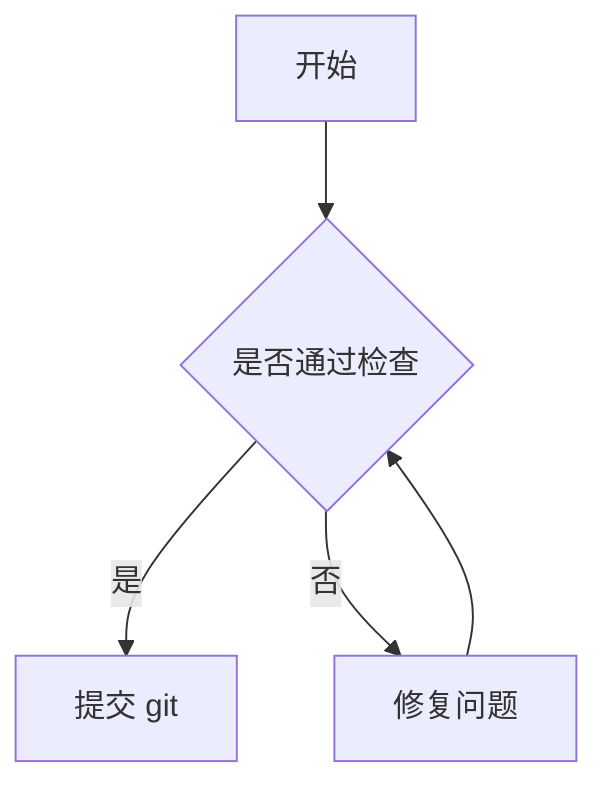
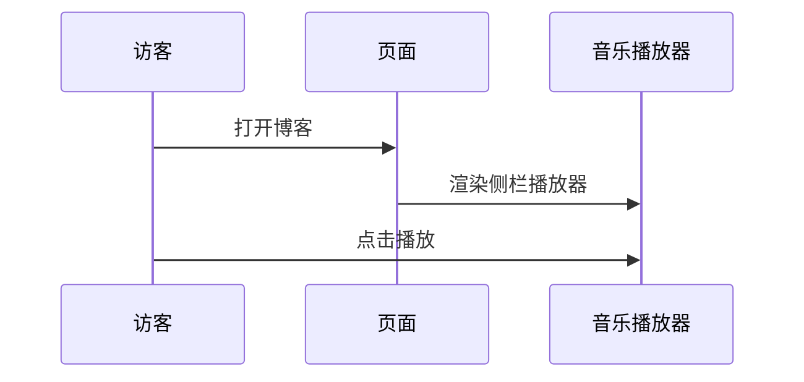
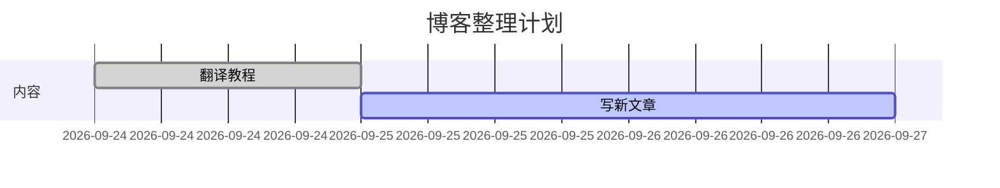

Mermaid 可以把文本描述渲染成图表，适合技术方案、流程说明和项目记录。

## 流程图

```mermaid
flowchart TD
  A[开始] --> B{是否通过检查}
  B -- 是 --> C[提交 git]
  B -- 否 --> D[修复问题]
  D --> B
```

## 时序图

```mermaid
sequenceDiagram
  participant U as 访客
  participant P as 页面
  participant M as 音乐播放器
  U->>P: 打开博客
  P->>M: 渲染侧栏播放器
  U->>M: 点击播放
```

## 甘特图

```mermaid
gantt
  title 博客整理计划
  dateFormat  YYYY-MM-DD
  section 内容
  翻译教程 :done, 2026-09-24, 1d
  写新文章 :active, 2026-09-25, 2d
```

Mermaid 图表适合表达结构，复杂视觉设计仍建议使用图片或专门绘图工具。
